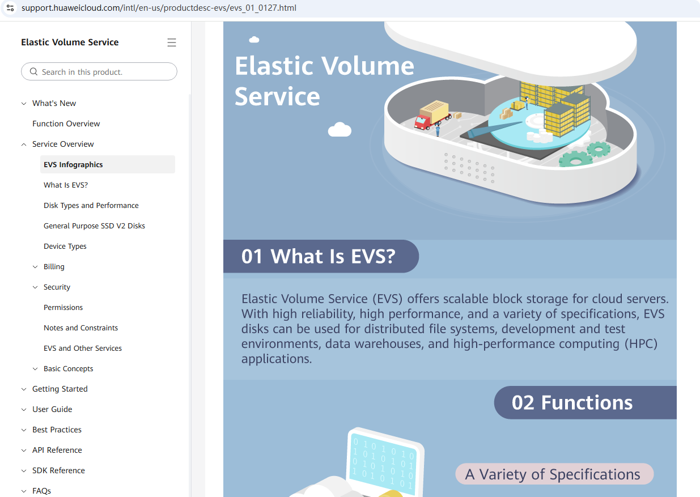
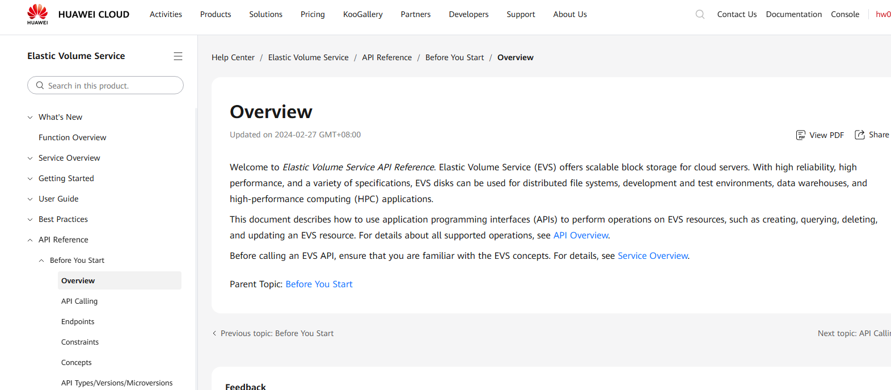
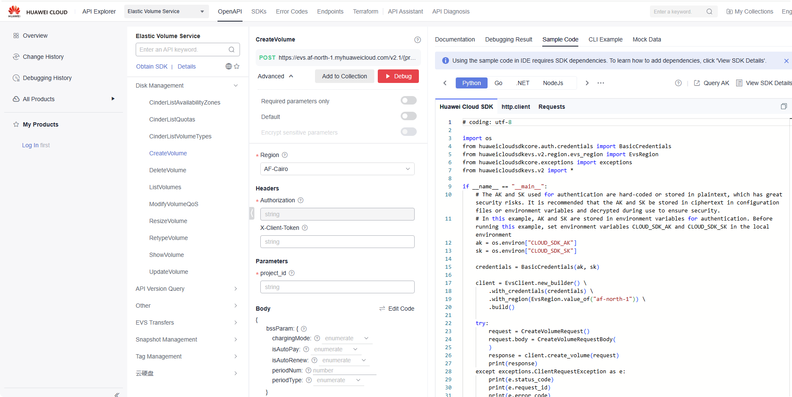
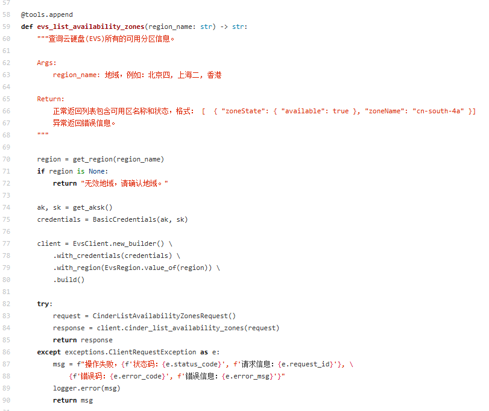
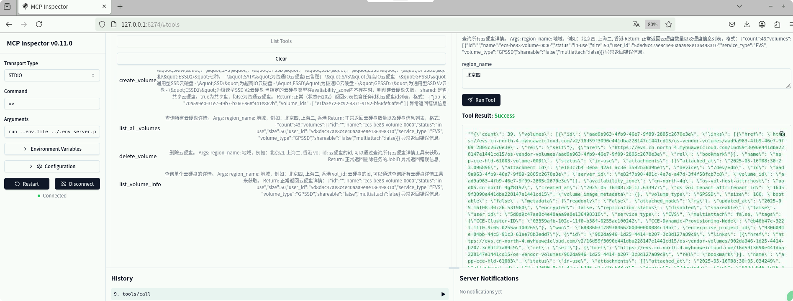
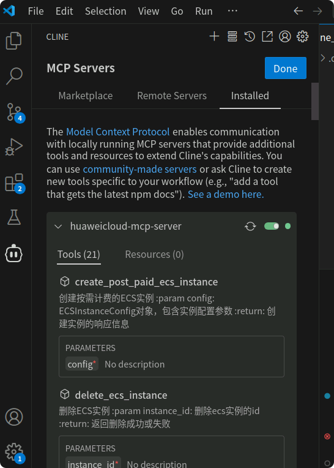
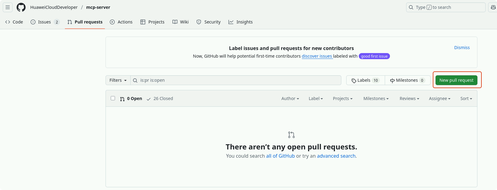

# Developing an MCP Service for a Huawei Cloud Product  
This article uses the Elastic Volume Service (EVS) as an example to guide open-source developers in creating an MCP service.  
The development is based on the product’s public API interfaces using the HuaweiCloud SDK.  

## Understanding Business Functions  
Navigate to the product page from the Huawei Cloud homepage and study its [business functions](https://support.huaweicloud.com/intl/en-us/productdesc-evs/evs_01_0127.html) and [API specifications](https://support.huaweicloud.com/intl/en-us/api-evs/evs_04_0016.html).  





## Debugging API Interfaces  
Huawei Cloud products provide an online API calling experience and SDK code in multiple languages.  
Go to [API Explorer](https://console.huaweicloud.com/apiexplorer/#/openapi/EVS/doc?api=CreateVolume), select the product, and generate corresponding code based on input parameters. Debugging allows you to observe the execution results.  
The code shown below can be used to develop the subsequent MCP service.  



## Developing the MCP Service  
### Setting Up the Development Environment  
- Download VSCode + Cline  
- Clone the current project code and configure the development environment according to the ReadMe  
- Refer to the existing `evs_tools` code for implementation  
- Reuse existing code for functionalities like AK/SK and logging  
  

## Validating the MCP Service  
### Code-Level Validation via Inspector  
[Reference Documentation](https://modelcontextprotocol.io/docs/tools/inspector)  
```shell  
npx @modelcontextprotocol/inspector <command> <arg1> <arg2>  
```  
  

### Natural Language Validation via Cline  
[Reference Documentation](https://docs.cline.bot/mcp/configuring-mcp-servers)  
  
  

## Submitting the Code  
### Create a Feature-Type Issue Describing the Development  
[Create an Issue](https://github.com/HuaweiCloudDeveloper/mcp-server/issues)  
  

### Create a PR for Review and Merging by Administrators  
[Create a PR](https://github.com/HuaweiCloudDeveloper/mcp-server/pulls)  
  

##  
## Congratulations on Completing MCP Development! Thank You for Contributing to Huawei Cloud’s Open-Source Ecosystem!  
